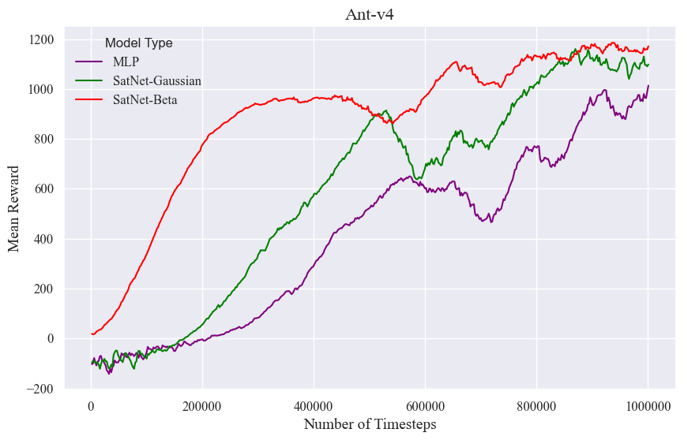
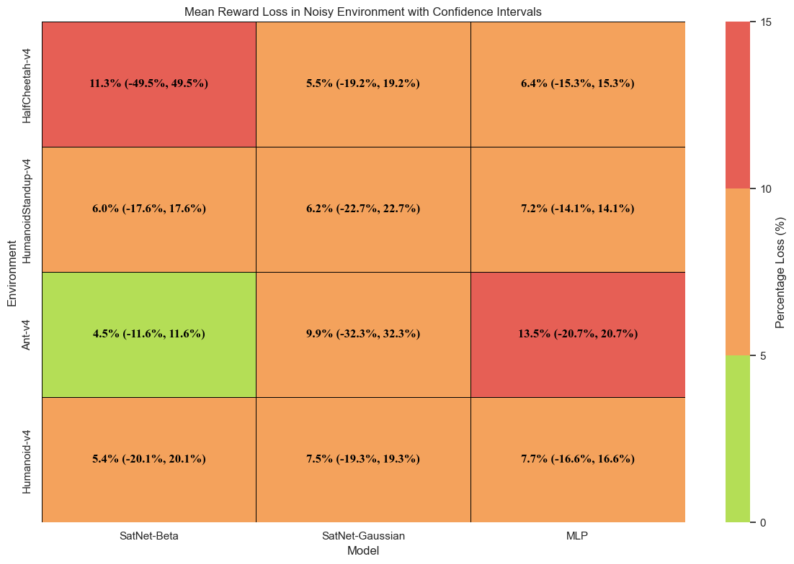
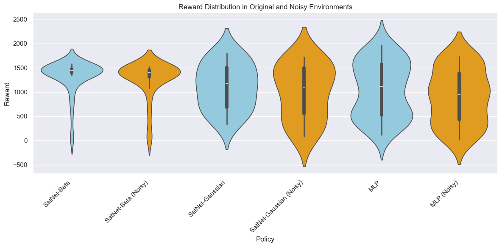

# SatNet: MSc Dissertation Project - Investigating Policy Distributions and Feature Extractors in Reinforcement Learning

[](https://opensource.org/licenses/MIT) <!-- Optional: Add a license badge if you have one -->

## Overview

This repository contains the code and results for the MSc dissertation project titled "SatNet: Skeletal Attention Network". The project explores the use of custom policy distributions (Beta) and advanced feature extractors (Graph Attention Networks, implemented as SatNet) within the Proximal Policy Optimization (PPO) algorithm for continuous control tasks in MuJoCo environments.

The primary goal was to compare the performance and robustness (especially under noisy observations) of PPO agents using:
1.  A standard Multi-Layer Perceptron (MLP) policy with a Gaussian distribution.
2.  A custom Graph Attention Network (GATv2-based) feature extractor with a Gaussian distribution.
3.  A custom Graph Attention Network feature extractor with a Beta distribution (rescaling actions to [0, 1]).

This project was submitted as part of the MSc program requirements. For a comprehensive understanding of the methodology, theoretical background, and detailed results, please refer to the full dissertation paper included in this repository:

📄 **[Msc_Individual Project_Mert Arcan_K23120474.pdf](./Msc_Individual%20Project_Mert%20Arcan_K23120474.pdf)**

## Key Features

*   Implementation of PPO using Stable Baselines3.
*   Custom `BetaPolicy` utilizing a Beta distribution for action sampling, suitable for potentially bounded action spaces.
*   Custom `NormalPolicy` utilizing a Gaussian distribution with a custom feature extractor.
*   `SatNet`: A custom feature extractor based on Graph Attention Networks (GATv2) designed to process MuJoCo environment observations.
*   Training and evaluation scripts for various MuJoCo environments (`Ant-v4`, `HalfCheetah-v4`, `Humanoid-v4`, `HumanoidStandup-v4`).
*   Evaluation framework to test agent robustness against noisy observations.
*   Hyperparameter tuning scripts (`src/eval.py`).
*   Results, logs, and generated charts comparing the different approaches.

## Technologies Used

*   **Programming Language:** Python 3.10
*   **Core Libraries:**
    *   [Stable Baselines3](https://github.com/DLR-RM/stable-baselines3): RL algorithms implementation (PPO).
    *   [PyTorch](https://pytorch.org/): Deep learning framework.
    *   [PyTorch Geometric](https://pytorch-geometric.readthedocs.io/en/latest/): Geometric deep learning extension library (likely used in GATv2 implementation).
    *   [Gymnasium (formerly OpenAI Gym)](https://gymnasium.farama.org/): RL environment toolkit.
    *   [MuJoCo](https://mujoco.org/): Physics simulator for robotic environments.
    *   NumPy: Numerical computation.
    *   Pandas: Data manipulation and analysis (for results).
    *   Matplotlib: Plotting and visualization.
*   **Environment:** MuJoCo Physics Engine

## Setup and Installation

1.  **Clone the repository:**
    ```bash
    git clone https://github.com/arjein/SatNet.git # Replace with your repo URL
    cd SatNet
    ```

2.  **Create a virtual environment (recommended):**
    ```bash
    python -m venv venv
    source venv/bin/activate  # On Windows use `venv\Scripts\activate`
    ```

3.  **Install MuJoCo:** Follow the official installation instructions for your operating system: [MuJoCo Installation](https://mujoco.readthedocs.io/en/stable/programming/index.html#installation). This often involves downloading the binaries and potentially setting environment variables. Ensure `mujoco` and `gymnasium[mujoco]` are installed correctly.

4.  **Install Python dependencies:**
    ```bash
    pip install -r requirements.txt
    ```

## Usage

The main script for training, testing, and evaluation is `src/main.py`.

**1. Training:**

To train a model, specify the environment and the algorithm type (MLP, GAUSSIAN, BETA).

```bash
python src/main.py --train --env <environment_name> --sb3_algo <MLP|GAUSSIAN|BETA>
```

*Example: Train a Beta policy on Ant-v4*
```bash
python src/main.py --train --env Ant-v4 --sb3_algo BETA
```

Models and logs will be saved in directories specified within `main.py` (currently hardcoded paths, consider making these relative or configurable).

**2. Continue Training:**

To continue training from a saved model checkpoint:

```bash
python src/main.py --continuetraining <path_to_model.zip> --env <environment_name> --sb3_algo <MLP|GAUSSIAN|BETA>
```

*Example: Continue training a Beta policy model for Ant-v4*
```bash
python src/main.py --continuetraining /path/to/your/models/Ant-v4/BETA_xxxxx.zip --env Ant-v4 --sb3_algo BETA
```

**3. Testing (Visualization):**

To visualize a trained agent's performance in the environment:

```bash
python src/main.py --test <path_to_model.zip> --env <environment_name>
```

*Example: Test a trained Beta policy model for Ant-v4*
```bash
python src/main.py --test /path/to/your/models/Ant-v4/BETA_xxxxx.zip --env Ant-v4
```

**4. Evaluation (Noisy Environment):**

To evaluate a trained agent's performance in both the original and a noisy version of the environment:

```bash
python src/main.py --evaluate <path_to_model.zip> --env <environment_name> --sb3_algo <MLP|GAUSSIAN|BETA>
```

*Example: Evaluate a trained Beta policy model for Ant-v4 under noise*
```bash
python src/main.py --evaluate /path/to/your/models/Ant-v4/BETA_xxxxx.zip --env Ant-v4 --sb3_algo BETA
```
Evaluation results (including performance degradation under noise) will be saved to JSON files in the `evaluations/` directory.

## Results

The project involved training and evaluating agents using MLP, Gaussian+SatNet, and Beta+SatNet policies across several MuJoCo environments. Key findings and comparisons are detailed in the dissertation PDF.

Visualizations of training progress and evaluation results can be found in the `charts/` directory. Raw evaluation data is available in the `evaluations/` directory and `.csv` files.

*   `charts/`: Contains plots like reward curves and comparative analyses (e.g., violin plots).
*   `evaluations/`: Contains JSON files with detailed evaluation metrics for original vs. noisy environments.
*   `evaluation_results.csv`, `evaluation_results_with_max_reward.csv`: CSV summaries of evaluation outcomes.

**Example Results:**

*Below are some sample visualizations from the `charts/` directory. Please refer to the dissertation for a full analysis.*

**Training Performance (Example: Ant-v4)**

*(Caption: Example reward curves during training for the Ant-v4 environment comparing MLP, Gaussian+SatNet, and Beta+SatNet.)*

**Robustness to Noise (Heatmap)**

*(Caption: Heatmap visualizing the performance degradation of different agents under noisy observations across environments.)*

**Comparative Performance Distribution (Example: Ant-v4 Violin Plot)**

*(Caption: Violin plot comparing the distribution of evaluation rewards for MLP, Gaussian+SatNet, and Beta+SatNet on the Ant-v4 environment.)*

A brief summary of results (as suggested by the files and code):
*   The custom policies (Beta, Gaussian with SatNet) were trained and compared against a standard MLP baseline.
*   Robustness to observational noise was a key evaluation metric, potentially showing advantages for certain policy/extractor combinations.
*   Hyperparameter tuning was performed (see `src/eval.py`).

**For detailed analysis and discussion, please consult the [dissertation PDF](./Msc_Individual%20Project_Mert%20Arcan_K23120474.pdf).**

## Repository Structure

```
├── chartPlotter.ipynb       # Jupyter notebook for plotting charts
├── Data.xlsx                # Raw data (likely experimental results)
├── evaluation_results*.csv  # Summarized evaluation results
├── Filtered_Data.xlsx       # Processed data
├── Msc_Individual Project...pdf # Dissertation paper
├── README.md                # This file
├── requirements.txt         # Python dependencies
├── charts/                  # Saved plots and figures
├── CSV/                     # CSV formatted data exports
├── evaluations/             # Evaluation results (JSON per model/env)
├── evaluations_copy/        # Backup of evaluations
├── filtered_logs/           # TensorBoard logs (filtered/processed)
├── src/                     # Source code
│   ├── beta_distribution.py # Custom Beta distribution for SB3
│   ├── beta_policy.py       # Custom ActorCriticPolicy using Beta/Normal dist + SatNet
│   ├── eval.py              # Hyperparameter tuning and evaluation helpers
│   ├── example_use.py       # Example script (if applicable)
│   ├── gatv2_conv_wrapper.py # Wrapper for GATv2 convolution layer
│   ├── graph_feature_extractor.py # Feature extractor using graph structure
│   ├── main.py              # Main script for training, testing, evaluation
│   ├── nerve_attention_net.py # Implementation of the SatNet/GATv2 network
│   └── noise_wrapper.py     # Gymnasium wrapper to add noise to observations
└── models/                  # (Not present, but likely where trained models are saved based on main.py)
└── logs/                    # (Not present, but likely where TensorBoard logs are saved based on main.py)
```

## Contributing

As this is a completed MSc project, contributions are not actively sought. However, feel free to fork the repository or raise issues if you find any bugs.

## License

<!-- Choose a license, e.g., MIT -->
This project is licensed under the MIT License - see the [LICENSE](LICENSE) file for details.

## Contact

Mert Arcan - mertarcan8@gmail.com - https://www.linkedin.com/in/mertarcan/